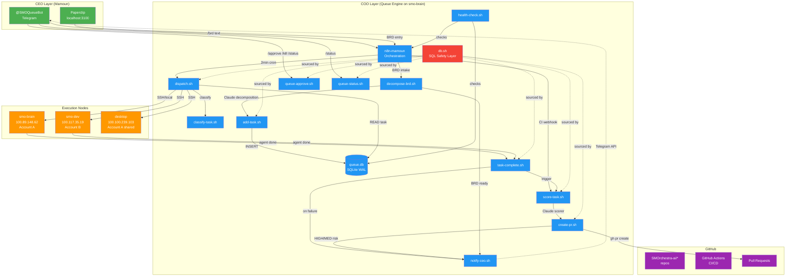
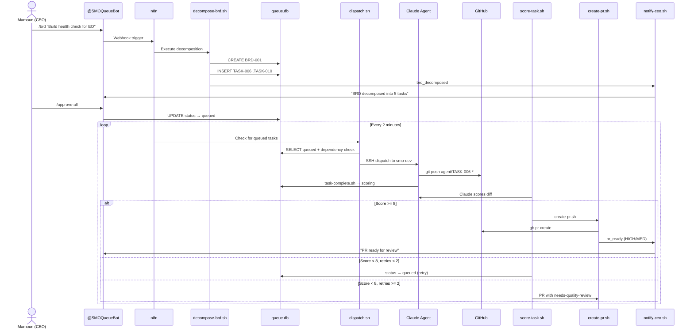
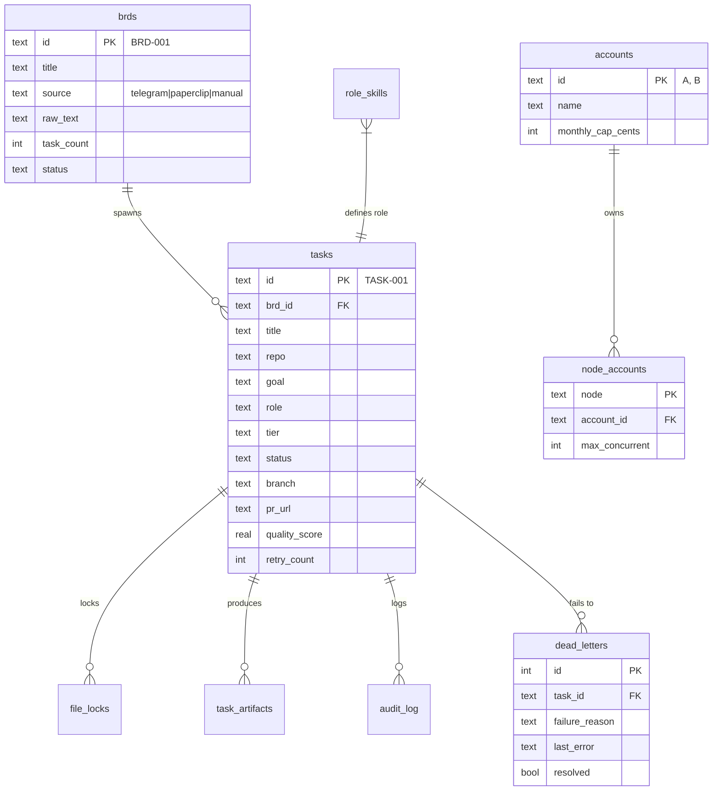
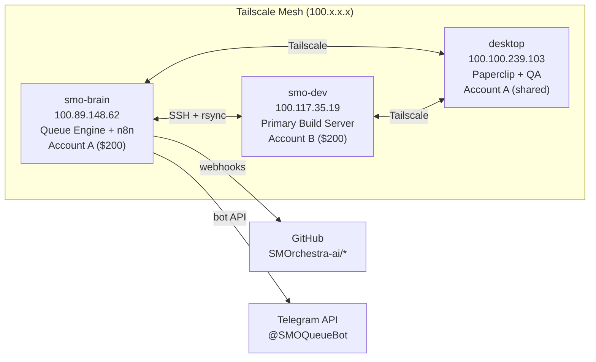

# AI-Native Organization — System Architecture Diagram

**Date:** 2026-03-30
**Version:** 1.0

## Full System Flow

## Data Flow: BRD to Merge

## Database Schema (ERD)

## Infrastructure Topology

